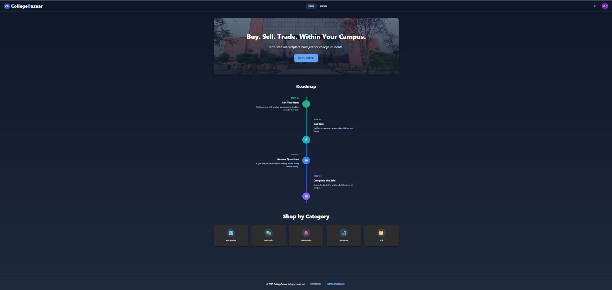

# CollegeBazaar

A campus marketplace web app where students can list, browse, and bid on items. Built with a React (Vite) frontend and an Express + PostgreSQL backend.

**Live demo:** [college-bazar-three.vercel.app](https://college-bazar-three.vercel.app)

## Features

- Email/password authentication with OTP verification, restricted to campus email domains
- Google OAuth login as an alternative sign-in method
- List, browse, and bid on items in a campus-only marketplace
- Image uploads via Cloudinary
- Automated cron jobs for product status updates
- Admin dashboard for moderation
- Query/support ticket system between buyers, sellers, and admins

## Tech Stack

**Frontend:** React (Vite), React Router, Axios, GSAP
**Backend:** Node.js, Express, PostgreSQL
**Auth:** JWT, Google OAuth 2.0
**Infra:** Cloudinary (image storage), Nodemailer (email/OTP), node-cron (scheduled jobs)
**Deployment:** Vercel (frontend), Render (backend + PostgreSQL)

## Structure

- `frontend/` — React + Vite client
- `backend/` — Express REST API + PostgreSQL

## Google OAuth Login

Students can sign in with their Google account (restricted to the campus email domain) or with email/password. See `backend/controllers/userController.js` (`googleLogin`) and `frontend/src/components/AuthPage.jsx` for the implementation, and the Setup section below for configuration.

## Setup

### Backend

\`\`\`bash
cd backend
npm install
cp .env_example .env   # fill in DATABASE_URL, JWT_SECRET, GOOGLE_CLIENT_ID, etc.
npm start
\`\`\`

### Frontend

\`\`\`bash
cd frontend
npm install
cp .env.example .env   # fill in VITE_API_URL, VITE_GOOGLE_CLIENT_ID
npm run dev
\`\`\`